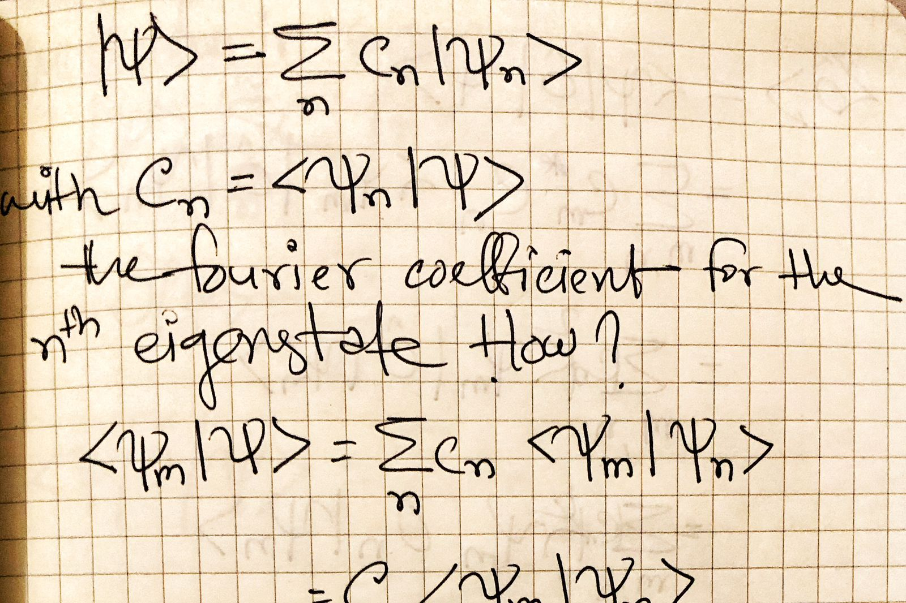

# **Shovon Rahman**

### *Theoretical Physics Graduate*
---
> *"I was an ordinary person who studied hard. There are no miracle people. It happens they get interested in this thing and they learn all this stuff, but they’re just people."*  
> — Richard Feynman

  

## **Introduction**
Hello! I am [Your Name], a passionate researcher with a keen interest in [your field of interest, e.g., particle physics, machine learning, etc.]. My work focuses on [brief description of your research interests]. I am driven by curiosity and an unrelenting desire to explore the fundamental questions of the universe through [specific tools or approaches you use, e.g., theoretical modeling, data analysis, etc.].

---

## **Research Projects**
- **[Project Title 1]:** Brief description of the project, its goals, and significance.
- **[Project Title 2]:** Brief description of the project, its goals, and significance.
- **[Project Title 3]:** Brief description of the project, its goals, and significance.

---

## **Skills**
- Programming Languages: [e.g., Python, C++, MATLAB]
- Analytical Tools: [e.g., ROOT, Matplotlib, NumPy]
- Data Analysis Techniques: [e.g., resampling methods, least chi-square fitting]
- Others: [e.g., LaTeX, version control systems like Git, etc.]

---

## **Workshops Attended**
- **Workshop Name 1** - [Topic/Description, e.g., Advanced Techniques in Machine Learning]
- **Workshop Name 2** - [Topic/Description, e.g., Hands-on Training in Lattice QCD]
- **Workshop Name 3** - [Topic/Description]

---

## **Educational Background**
- **[Degree Name, e.g., Ph.D. in Physics]** - [Institution Name], [Year]
- **[Degree Name, e.g., Master of Science in Applied Mathematics]** - [Institution Name], [Year]
- **[Degree Name, e.g., Bachelor of Science in Physics]** - [Institution Name], [Year]

---

## **Professional Background**
- **[Role/Position Name]** - [Organization Name]  
  [Brief description of your role and achievements.]
- **[Role/Position Name]** - [Organization Name]  
  [Brief description of your role and achievements.]

---

## **Career Goals**
My long-term goal is to contribute significantly to [specific area or field, e.g., particle physics or uncertainty quantification in theoretical physics]. I aim to bridge the gap between theoretical insights and practical applications, thereby advancing the boundaries of knowledge and fostering collaboration across disciplines.

---

## **Contact Me**
- **Email:** [your.email@example.com]
- **LinkedIn:** [Your LinkedIn URL]
- **GitHub:** [Your GitHub URL]
- **Website:** [Your Personal Website URL]

Feel free to reach out if you have questions about my work or if you’d like to collaborate on a project!
